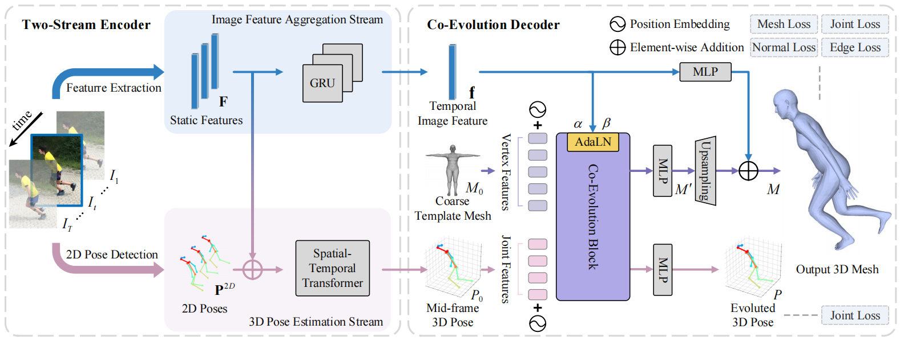

<div align="center">

  <h1 align="center">Co-Evolution of Pose and Mesh for 3D Human Body Estimation from Video (ICCV 2023)</h1>
  
</div>

<div align="left">

  <a href="https://pytorch.org/get-started/locally/"></a>
  <a href="https://kasvii.github.io/PMCE/"></a> <a href="https://youtu.be/slSPQ9hNLjM">
  [](https://arxiv.org/pdf/2308.10305.pdf)
  <a href="https://github.com/kasvii/PMCE/blob/main/LICENSE"></a>

</div>


This is the offical [Pytorch](https://pytorch.org/) implementation of the paper:
<h3 align="center">Co-Evolution of Pose and Mesh for 3D Human Body Estimation from Video (ICCV 2023)</h3>

<h4 align="center" style="text-decoration: none;">
  <a href="https://kasvii.github.io/", target="_blank"><b>Yingxuan You</b></a>
  ,
  <a href="https://scholar.google.com/citations?hl=zh-CN&user=4CQKG8oAAAAJ", target="_blank"><b>Hong Liu</b></a>
  ,
  <a href="https://scholar.google.com/citations?user=PjBAErYAAAAJ&hl=zh-CN&oi=sra", target="_blank"><b>Ti Wang</b></a>
  ,
  <a href="https://vegetebird.github.io/", target="_blank"><b>Wenhao Li</b></a>
  ,
  <a href="https://scholar.google.com/citations?user=gU9chAwAAAAJ&hl=zh-CN&oi=sra", target="_blank"><b>Runwei Ding</b></a>,
  <a href="https://xialipku.github.io/", target="_blank"><b>Xia Li</b></a>

</h4>
<h4 align="center">
  <a href="https://kasvii.github.io/PMCE/", target="_blank">project page</a> /
  <a href="https://arxiv.org/pdf/2308.10305.pdf", target="_blank">arXiv</a> /
  <a href="https://openaccess.thecvf.com/content/ICCV2023/papers/You_Co-Evolution_of_Pose_and_Mesh_for_3D_Human_Body_Estimation_ICCV_2023_paper.pdf", target="_blank">paper</a> /
  <a href="https://openaccess.thecvf.com/content/ICCV2023/supplemental/You_Co-Evolution_of_Pose_ICCV_2023_supplemental.pdf", target="_blank">supplementary</a>
</h4>

<p align="center">
     
</p>
<p align="center">
   
   
   
   
</p>


## Preparation

1. Install dependencies. This project is developed on Ubuntu 18.04 with NVIDIA 3090 GPUs. We recommend you to use an [Anaconda](https://www.anaconda.com/) virtual environment.
```bash
# Create a conda environment.
conda create -n pmce python=3.8
conda activate pmce

# Install PyTorch >= 1.2 according to your GPU driver.
conda install pytorch==1.10.0 torchvision==0.11.0 torchaudio==0.10.0 cudatoolkit=11.3 -c pytorch -c conda-forge

# Pull the code
git clone https://github.com/kasvii/PMCE.git
cd PMCE

# Install other dependencies.
sh requirements.sh
```

2. Prepare SMPL layer. 
- For the SMPL layer, We used [smplpytorch](https://github.com/gulvarol/smplpytorch). The repo is already included in `./smplpytorch` folder.
- Download `basicModel_f_lbs_10_207_0_v1.0.0.pkl`, `basicModel_m_lbs_10_207_0_v1.0.0.pkl`, and `basicModel_neutral_lbs_10_207_0_v1.0.0.pkl` from [here](https://smpl.is.tue.mpg.de/downloads) (female & male) and [here](http://smplify.is.tue.mpg.de/) (neutral) to `./smplpytorch/smplpytorch/native/models`.

## Quick Demo
1. Install [ViTPose](https://github.com/ViTAE-Transformer/ViTPose). PMCE uses the off-the-shift 2D pose detectors to detect persons from images. Here we take and install ViTPose. 
```bash
git clone https://github.com/open-mmlab/mmcv.git
cd mmcv
git checkout v1.3.9
MMCV_WITH_OPS=1 pip install -e .
cd ..
git clone https://github.com/ViTAE-Transformer/ViTPose.git
cd ViTPose
pip install -v -e .
```
2. Download the pre-trained ViTPose model `vitpose-h-multi-coco.pth` from [OneDrive](https://1drv.ms/f/s!Alg46BPWJg_Xgj6Zim2WCoF5SnbL?e=dtnem2). Put it below `./pose_detector` folder.
3. Download the pre-trained PMCE model `mesh_vis.pth.tar` from [OneDrive](https://1drv.ms/f/s!Alg46BPWJg_XgXCTabSm_2wRfIN8?e=BnpbLV). Put it below `./experiment/pretrained` folder.
4. Prepare the input video `*.mp4` and put it below `./demo` folder. 
5. Run. The output is at `./output` folder.
```bash
# Change 'sample_video' to your video name.
python ./main/run_demo.py --vid_file demo/sample_video.mp4 --gpu 0
```

## Implementation
### Data Preparation
The `./data` directory structure should follow the below hierarchy. Download all the processed annotation files from [OneDrive](https://1drv.ms/f/s!Alg46BPWJg_XgVf-q5qKdkalhgOj?e=LmGZ8n)
```
${Project}  
|-- data  
|   |-- base_data
|   |   |-- J_regressor_extra.npy
|   |   |-- mesh_downsampling.npz
|   |   |-- smpl_mean_params.npz
|   |   |-- smpl_mean_vertices.npy
|   |   |-- SMPL_NEUTRAL.pkl
|   |   |-- spin_model_checkpoint.pth.tar
|   |-- COCO  
|   |   |-- coco_data  
|   |   |-- __init__.py
|   |   |-- dataset.py
|   |   |-- J_regressor_coco.npy
|   |-- Human36M  
|   |   |-- h36m_data  
|   |   |-- __init__.py
|   |   |-- dataset.py 
|   |   |-- J_regressor_h36m_correct.npy
|   |   |-- noise_stats.py
|   |-- MPII  
|   |   |-- mpii_data  
|   |   |-- __init__.py
|   |   |-- dataset.py
|   |-- MPII3D
|   |   |-- mpii3d_data  
|   |   |-- __init__.py
|   |   |-- dataset.py
|   |-- PW3D 
|   |   |-- pw3d_data
|   |   |-- __init__.py
|   |   |-- dataset.py
|   |-- multiple_datasets.py
```

### Test
To test on a pre-trained pose estimation model (Stage 1).
```bash
# Human3.6M
bash test_pose_h36m.sh

# 3DPW
bash test_pose_3dpw.sh
```

To test on a pre-trained mesh model (Stage 2).
```bash
# Human3.6M
bash test_mesh_h36m.sh

# 3DPW
bash test_mesh_3dpw.sh

# MPII3D
bash test_mesh_mpii3d.sh
```
Change the `weight_path` in the corresponding `./config/test_*.yml` to your model path.


### Train
Stage 1 (optional): Train the 3D pose estimation stream or you can directly use our pre-traind pose model `./experiment/pretrained/pose_*.pth.tar` for Stage 2.
```bash
# Human3.6M
bash train_pose_h36m.sh

# 3DPW
bash train_pose_3dpw.sh
```

Stage 2: To train the all network for final mesh. Configs of the experiments can be found and edited in `./config` folder. Change `posenet_path` in `./config/train_mesh_*.yml` to the path of the pre-trained pose model.
```bash
# Human3.6M
bash train_pose_h36m.sh

# 3DPW
bash train_pose_3dpw.sh
```


## Citation
Cite as below if you find this repository is helpful to your project:
```bibtex
@inproceedings{you2023co,
  title     = {Co-Evolution of Pose and Mesh for 3D Human Body Estimation from Video},
  author    = {You, Yingxuan and Liu, Hong and Wang, Ti and Li, Wenhao and Ding, Runwei and Li, Xia},
  booktitle = {Proceedings of the IEEE/CVF International Conference on Computer Vision},
  pages     = {14963--14973},
  year      = {2023}
}
```


## Acknowledgement
This repo is extended from the excellent work [Pose2Mesh](https://github.com/hongsukchoi/Pose2Mesh_RELEASE), [TCMR](https://github.com/hongsukchoi/TCMR_RELEASE). We thank the authors for releasing the codes.